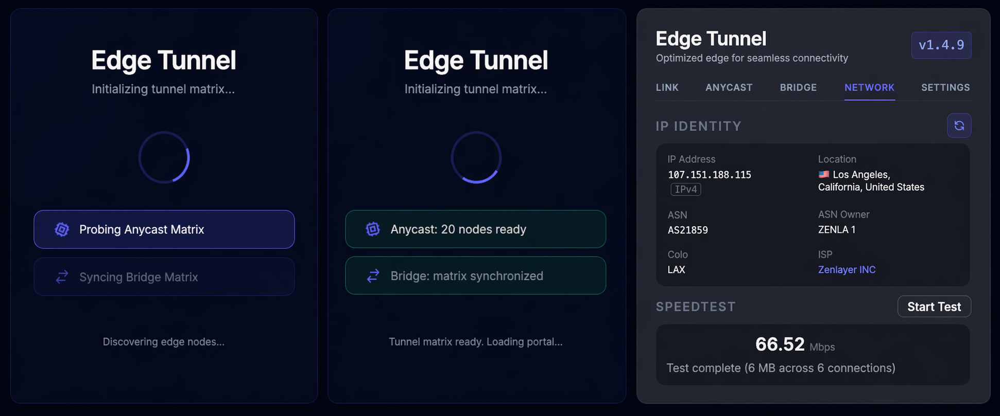
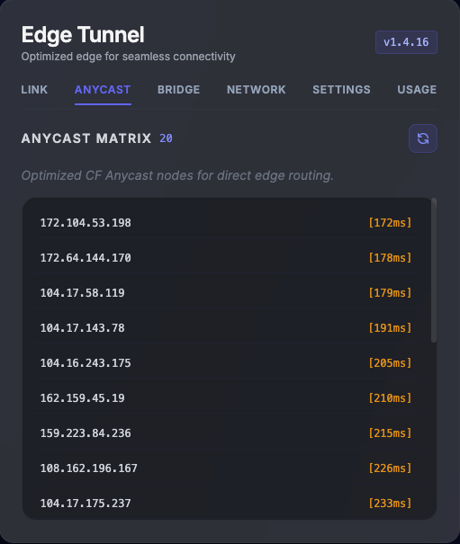
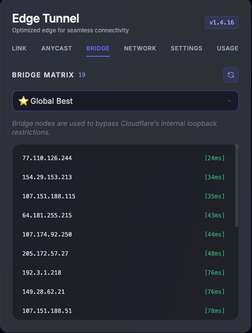
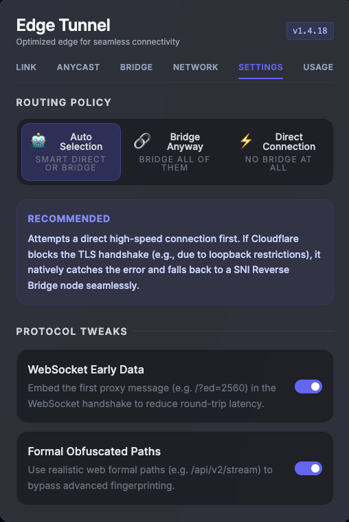
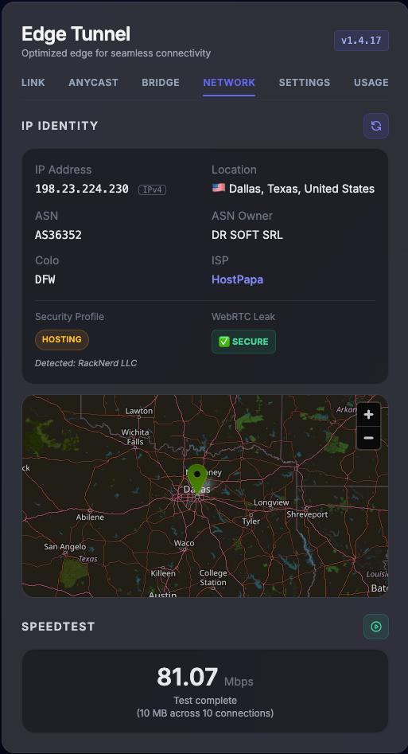
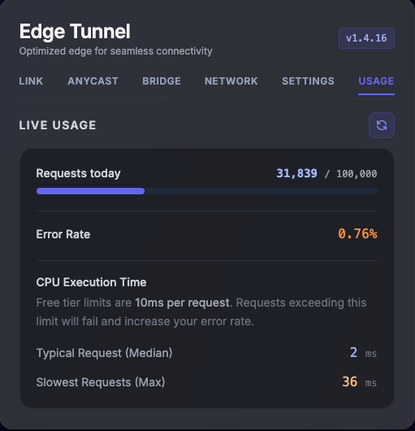

# tunnel-worker


A stateless WebSocket tunnel running on the Cloudflare edge network. Routes encrypted proxy traffic through Cloudflare Workers with an autonomous IP optimization engine and a self-bootstrapping admin portal.

## Quick Deploy (No source code required)

**Prerequisites**

- A [Cloudflare account](https://dash.cloudflare.com/sign-up)
- Node.js installed (`node -v` to verify)

**Steps**

1. Go to the [**Releases**](../../releases/latest) page and download `tunnel-worker.zip`.

2. Extract the zip and open a terminal inside the extracted folder.

3. Deploy to Cloudflare Workers:
   ```bash
   npx wrangler deploy
   ```

   Wrangler will prompt you to log in on the first run. It will also detect the required `TUNNEL` KV namespace, create it automatically, and bind it to your Worker.

4. Open your browser and visit:
   ```
   https://<your-worker-name>.<your-subdomain>.workers.dev/admin
   ```

   On the **first visit**, the portal will automatically generate a secure admin token, and redirect you to your unique admin URL. **Bookmark that URL** and **Don't lose it** — it's your permanent admin link.

---

## Admin Portal

Access your admin panel at `/admin?token=<your-token>`. The portal provides:

| Feature | Description |
|---|---|
| **UUID Management** | View and rotate the VLESS authentication UUID |
| **IP Sync** | Crawls public Cloudflare IP databases to find optimal routing nodes |
| **Protocol Tweaks** | Stealth and performance optimizations for bypass-hardening |
| **Subscription Link** | A QR code and copyable Base64 subscription URL for proxy clients |

> **Security note:** The admin token is generated on first access and stored exclusively in your private KV namespace. It never appears in source code or configuration files.

---

## Subscription Endpoint

Proxy clients (V2RayN, Clash, Shadowrocket, etc.) can import the subscription URL directly:

```
https://<your-domain>/sub?token=<your-uuid>
```

The subscription URL is displayed in the admin portal along with a scannable QR code. The endpoint returns a Base64-encoded list of VLESS URIs using the optimized IP nodes from the last sync.

---

## Edge & Bridge IPs

The tunnel utilizes two distinct IP mechanisms to ensure optimal connectivity and resilience. These can be synchronized via the Admin Portal:

| Anycast Matrix | Bridge Matrix |
|:---:|:---:|
|  |  |

- **Anycast Edge IPs**: Direct Cloudflare edge nodes ranked by client-to-edge latency. These provide the fastest and most direct connection path for your proxy clients.
- **Reverse Proxy Bridge IPs**: Fallback external relays. If direct connections to the target are blocked or restricted, the worker routes traffic through these bridge nodes to maintain connectivity.
- **Auto Update**: Both IP matrices are automatically updated in the CF background (cron) to keep them as up-to-date and usable as possible.

---

## Routing & Optimization

The portal offers granular control over routing logic and protocol-level optimizations to ensure maximum performance and stealth:



- **Flexible Routing**: Effortlessly switch between **Auto**, **Direct**, or **Bridge** modes to optimize for speed or bypass network-specific restrictions.
- **Protocol Tweaks**: 
  - **WebSocket Early Data**: Reduces round-trip latency by embedding the first proxy message directly in the WebSocket handshake (e.g., `/?ed=2560`).
  - **Formal Obfuscated Paths**: Evades DPI fingerprinting by using randomized, realistic web asset paths (e.g., `/api/v1/stream`, `/api/v2/events/stream`).

---

## Network Diagnostics

The portal includes a network diagnostic suite, allowing you to monitor real-time IP identity, location data, and perform speedtests directly from the edge.



---

## Live Telemetry

Monitor your tunnel's performance in real-time through the integrated Cloudflare telemetry dashboard. Access request volume, CPU execution time, and error rates directly from the portal.



- **Real-time Metrics**: Track active traffic patterns and isolate potential bottlenecks.
- **Performance Monitoring**: Monitor CPU execution time and resource utilization across the global edge.
- **Error Tracking**: Identify and debug connection failures or upstream handshake issues instantly.

---

## Configuration

You can customize the `wrangler.toml` file before deployment:

- **`name`**: You can change this to any name you prefer for your Worker.
- **`binding = "TUNNEL"`**: **DO NOT CHANGE THIS.** The code is hard-wired to look for the `TUNNEL` binding.

### Custom Domain (Optional)

To bind your own domain, edit `wrangler.toml`:

```toml
[[routes]]
pattern = "your.domain.com"
custom_domain = true
```

---

## License

MIT
