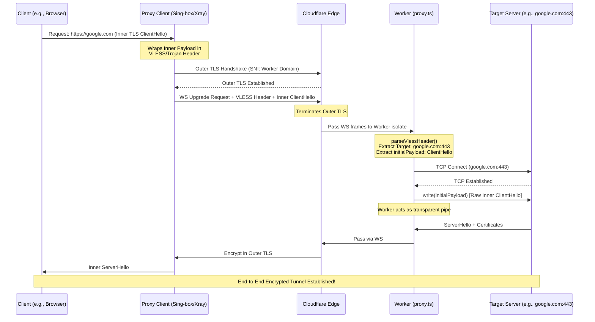

# Tunnel Worker Architecture & Proxy Mechanism

## 1. Architectural Overview

The Tunnel Worker is a serverless edge application built on Cloudflare Workers that acts as a secure, high-performance proxy. It natively supports modern proxy protocols (VLESS and Trojan) over WebSocket connections. 

The fundamental purpose of this worker is to accept inbound WebSocket connections, authenticate the client payload, extract the routing instructions, and establish a raw TCP socket to the final destination (e.g., `google.com:443`). It then functions as a transparent, bidirectional pipe between the client and the target server.

## 2. The "TLS-in-TLS" Paradigm

A critical concept to understand when auditing this codebase is the **"TLS-in-TLS"** encapsulation model. This mechanism guarantees end-to-end encryption between the client and the final destination server, despite the traffic passing through our proxy.

When a client wants to access a secure website (HTTPS), the traffic flows as follows:

1.  **Outer Tunnel:** The proxy client (e.g., Sing-box, Xray) establishes a secure WebSocket connection to our Cloudflare Worker domain. This connection is secured by standard TLS. Cloudflare's Edge network automatically terminates this **Outer TLS** layer.
2.  **Inner Payload:** Inside the WebSocket frames, the client sends a protocol header (VLESS or Trojan) containing routing instructions, immediately followed by the original traffic intended for the final destination.
3.  **Inner TLS:** Because the final destination is an HTTPS server, the original traffic is an **Inner TLS `ClientHello`**. 

Our worker receives the decrypted WebSocket frames, parses the protocol header to find the destination, but **it never touches or attempts to decrypt the Inner TLS payload**. It blindly pipes those raw encrypted bytes directly to the destination.

## 3. Protocol Elegance: VLESS vs. Trojan

Historically, legacy proxy protocols (like Shadowsocks or VMess) implemented bespoke, heavy application-layer encryption to obfuscate traffic. However, in the modern web ecosystem, the vast majority of traffic is already natively encrypted via TLS (HTTPS). Applying a second layer of proxy encryption over an already encrypted TLS payload is computationally redundant, increases latency, and unnecessarily burdens both the client and the edge worker.

Both **VLESS** and **Trojan** are paradigm-shifting protocols designed with this exact realization. They exhibit architectural elegance by adopting a **Zero-Encryption** philosophy for the payload itself when operating over a secure transport:

*   **Reliance on Transport Security:** Instead of encrypting the data, both protocols rely entirely on the secure transport layer (the Outer TLS to Cloudflare) to provide cryptographic security and obfuscation against Deep Packet Inspection (DPI).
*   **Stripped-Down Headers:** They merely prepend a lightweight, unencrypted routing header (containing authentication and destination instructions) to the raw payload. 
*   **Zero-Cost Payload:** Once the header is parsed, the proxy blindly pipes the remaining bytes. Because the inner payload is typically an already-encrypted TLS `ClientHello`, the data remains secure end-to-end without incurring the CPU overhead of double-encryption.

### Key Differences in Implementation

While sharing the same zero-encryption philosophy, they differ slightly in their header structures, as implemented in `proxy.ts`:

| Feature | VLESS | Trojan |
| :--- | :--- | :--- |
| **Header Identifier** | Starts with `0x00` (Version byte). | Does not have a strict version byte; relies on password hash structure. |
| **Authentication** | Uses a raw 16-byte binary representation of a UUID. | Uses a 56-byte hex-encoded SHA-224 hash of the password. |
| **Address Types** | Custom mapping (`0x01` IPv4, `0x02` Domain, `0x03` IPv6). | Standard SOCKS5 mapping (`0x01` IPv4, `0x03` Domain, `0x04` IPv6). |
| **Delimiter** | Relies on strict byte lengths and offset counting. | Uses explicit `CRLF` (`\r\n` -> `0x0D 0x0A`) boundaries. |

Ultimately, both protocols achieve the exact same elegant outcome: securely encapsulating an Inner TLS session within an Outer TLS tunnel while virtually eliminating protocol overhead.

## 4. Step-by-Step Data Flow

The core proxy logic resides within `src/handlers/proxy.ts`. 

### Stage 1: Edge Ingress & WebSocket Upgrade
The Cloudflare Worker receives standard HTTP/HTTPS requests. If a request includes a valid `Upgrade: websocket` header and matches our expected routing path, the worker accepts the WebSocket upgrade, transitioning the HTTP request into a persistent, full-duplex stream.

### Stage 2: Initial Chunk Processing (`processFirstChunk`)
Upon receiving the very first WebSocket frame, the worker delegates processing to `processFirstChunk()`. 
*   It examines the first byte to determine the protocol (`0x00` for VLESS, other bytes for Trojan).
*   It passes the raw bytes to the respective parser: `parseVlessHeader` or `parseTrojanHeader`.

### Stage 3: Protocol Parsing & Authentication
The parsers dissect the binary header structure:
*   **Authentication:** The UUID or Password hash is extracted and verified against the expected credentials configured in the environment. Unauthenticated connections are instantly closed (`1008 Unauthorized`).
*   **Routing:** The destination Address (IPv4, Domain, or IPv6) and Port are extracted.
*   **Payload Extrication:** The remaining bytes following the protocol header are extracted and assigned to the variable `initialPayload`. **This `initialPayload` is the raw inner traffic (e.g., the TLS `ClientHello`).**

### Stage 4: Transparent TCP Egress
Once parsed, the Worker invokes `connectTo()` (which utilizes `cloudflare:sockets`) to open a raw TCP connection to the target destination.

Crucially, as soon as the TCP connection is established, the worker performs the following action:
```typescript
if (initialPayload.byteLength > 0) await tcpWriter.write(initialPayload);
```
It writes the `initialPayload` verbatim into the new TCP pipe. 

### Stage 5: Bidirectional Streaming
Following the initial payload transmission, the worker utilizes the Streams API (`pipeTo`) to seamlessly and asynchronously forward all subsequent data between the `WebSocket` and the `TCP Socket` until either endpoint terminates the connection.

## 5. Sequence Diagram



## 6. Summary

By decoupling the routing protocol (VLESS/Trojan) from the application-layer payload (Inner TLS), the codebase achieves a Zero-Cost Abstraction for the payload itself. The worker never engages in deep packet inspection of the tunneled traffic, ensuring maximum throughput, minimized latency, and absolute cryptographic integrity for the end user.
